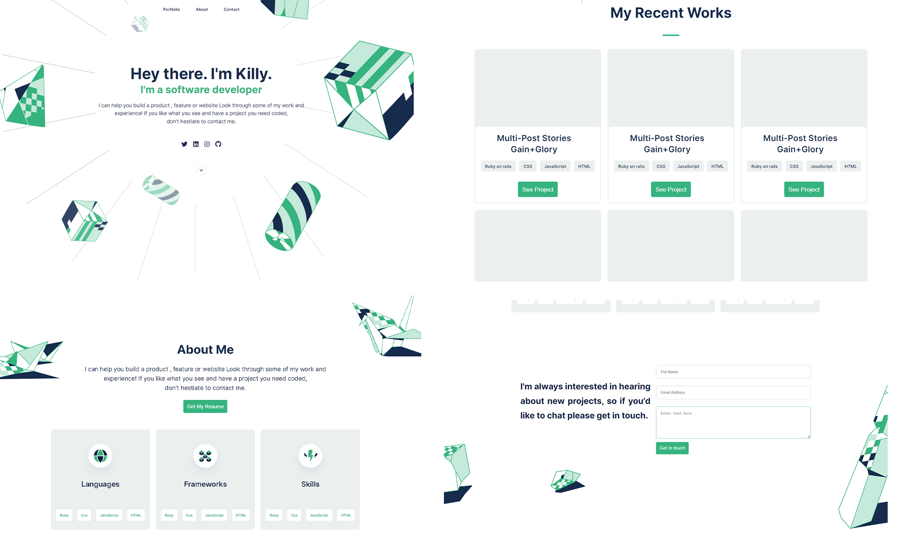
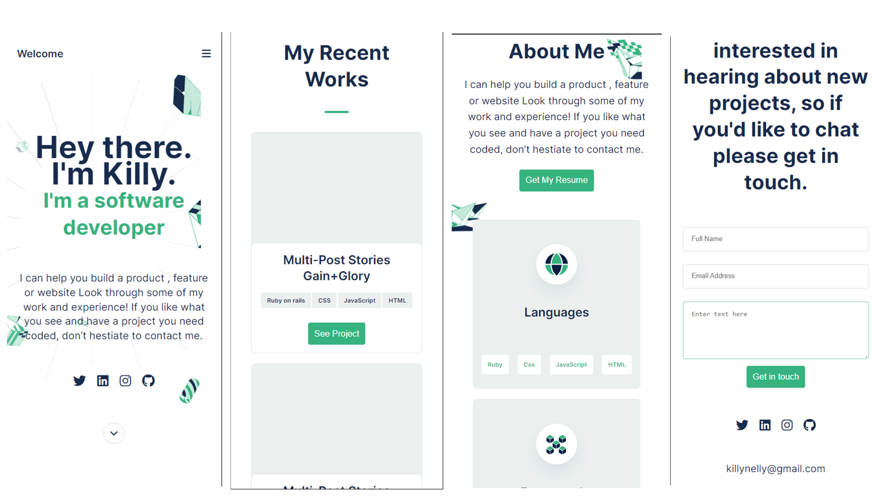
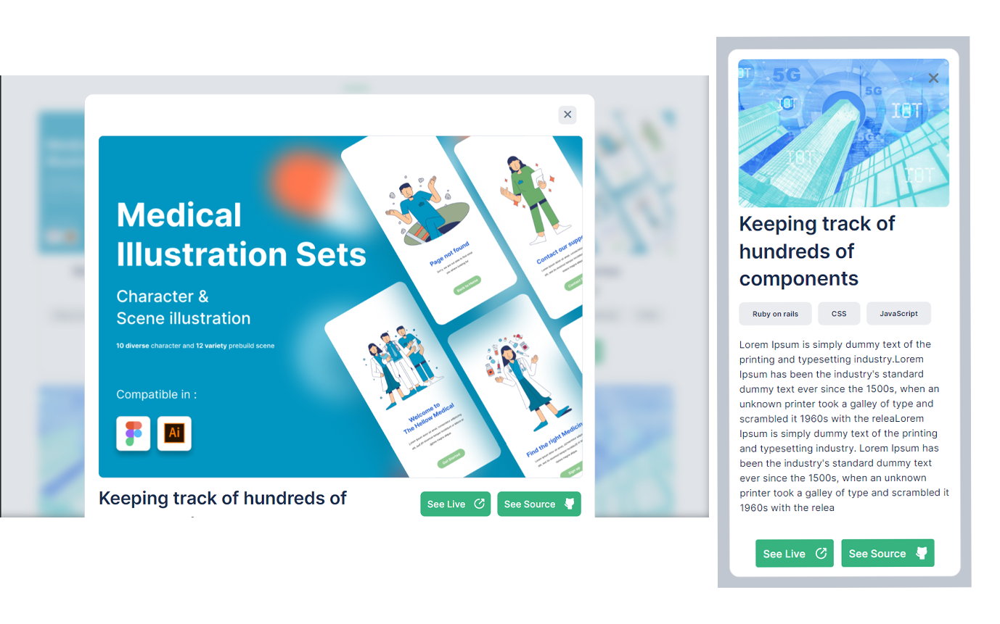

# Portfolio Project

## Live Demo

[Live Demo Link](https://killy10o10.github.io/Portfolio-Mobile/)

> Simple Portfolio project to showcase some of my works as a software developer.

## Built With

- HTML
- CSS
- javascript

## Author

👤 **Okine Kingsley**

- GitHub: [@killy10o10](https://github.com/killy10o10)
- Twitter: [@Quami_Killy](https://twitter.com/Quami_Killy)
- Instagram: [quami_killy](https://www.instagram.com/quami_killy/)

## Collaborators

👤 **Favour Ezeugwa**

- GitHub: [@favourezeugwa](https://github.com/Favourezeugwa)
- Instagram: [ama_ez](https://www.instagram.com/ama_ez/)

👤 **Farida Hamid**

- GitHub: [@Farida-Hamid](https://github.com/Farida-Hamid)

## 🤝 Contributing

Contributions, issues, and feature requests are welcome!

## Show your support

Give a ⭐️ if you like this project!

## Acknowledgments

- Hat tip to anyone who's code/resource was used
- Inspiration
- etc

## 📝 License

This project is [MIT](./MIT.md) licensed.
